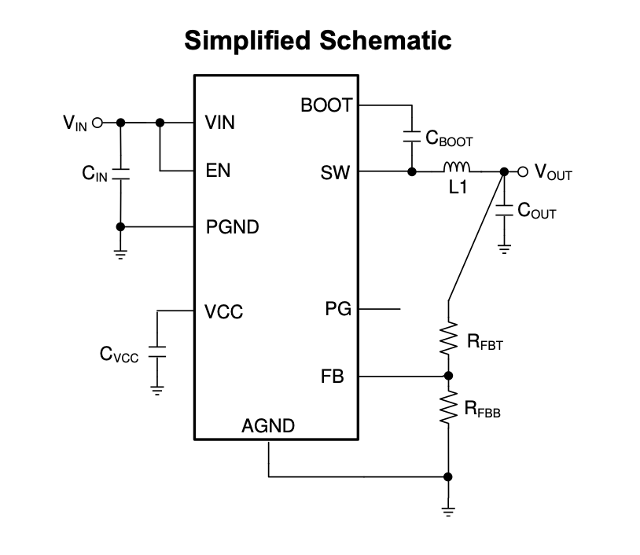

# Useful Electronic Components

## Buck Converter
A buck converter (step-down converter) is a DC-to-DC power converter which steps down voltage (while stepping up current) from its input (supply) to its output (load). It is a class of switched-mode power supply (SMPS) typically containing at least two semiconductors (a diode and a transistor, although modern buck converters frequently replace the diode with a second transistor used for synchronous rectification) and at least one energy storage element, a capacitor, inductor, or the two in combination. To reduce voltage ripple, filters made of capacitors (sometimes in combination with inductors) are normally added to such a converter's output (load-side filter) and input (supply-side filter).

Switching converters (such as buck converters) provide much greater power efficiency as DC-to-DC converters than linear regulators, which are simpler circuits that lower voltages by dissipating power as heat, but do not step up output current.

Buck converters can be highly efficient (often higher than 90%), making them useful for tasks such as converting a computer's main (bulk) supply voltage (often 12 V) down to lower voltages needed by USB, DRAM and the CPU (1.8 V or less)

An example is Ti's [LM33630](https://www.ti.com/lit/ds/symlink/lmr33630.pdf?ts=1605011386676&ref_url=https%253A%252F%252Fwww.ti.com%252Fproduct%252FLMR33630) chip:
