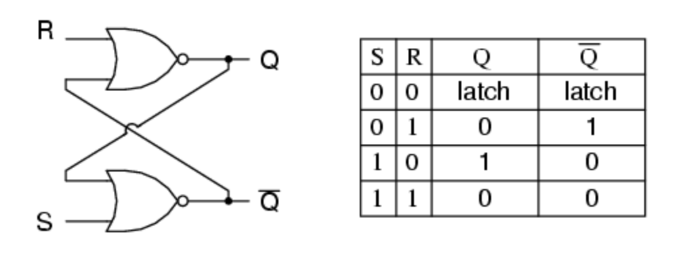
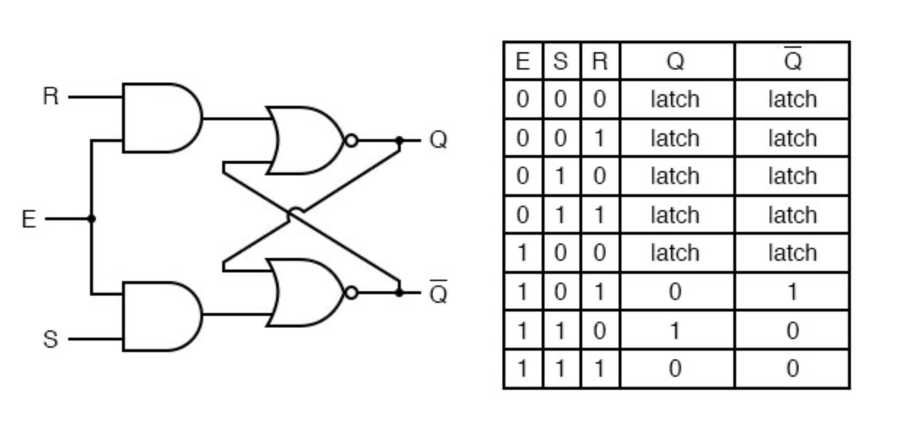
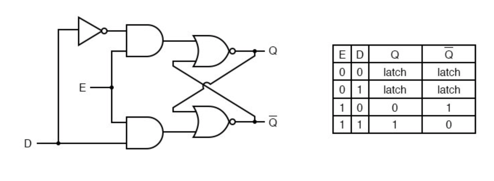

# Multivibrators

Multivibrators are any circuit using a feedback loop. There are different classes of multivibrators:
1. Monostable - One stable state, the other momentary
2. Bistable - Two stable states
3. Astable - No stable states; constantly oscillating.

## Bistable Multivibrators
### SR Latch
The simplest form of a bistable multivibrator is an SR Latch which stands for SET and RESET (the two stable states). This is done by combining 2 NOR gates in a feedback loop:

In an SR latch, activation of the S input sets the circuit, while activation of the R input resets the circuit. If both S and R inputs are activated simultaneously, the circuit will be in an invalid condition. In other words, if Q and not-Q happen to be forced to the same state (both 0 or both 1), that state is referred to as invalid.

A *race condition* is a state in a sequential system where two mutually-exclusive events are simultaneously initiated by a single cause. Both Q and not-Q could be in the same state by the same source cause (such as power up) but is unlikley due to small deviations in gate speed. However we can add a time delay to one of the gates to ensure a race condition cannot happen.

### SR Gated Latch
SR Latch with an enable pin. The advantage of this design is that it provides a way to latch the Q and not-Q outputs without regard to the status of S or R.

### D-Latch
The SR Gated latch binds the latch and we can eliminate one of those inputs to create a multivibrator latch circuit with no “illegal” input states:

The R input has become the complement of S and S has become D. Simply put when E is 0 the Q and Q-not stay latched and when E is 1 Q follows D. Since the previously variable R input has been removed this latch has no invalid states since Q and Q-not are always opposite of each other.

The D Latch is a 1-bit memory circuit. You can “write” (store) a 0 or 1 bit in this latch circuit by making the enable input high (1) and setting D to whatever you want the stored bit to be. When the enable input is made low (0), the latch ignores the status of the D input and holds the stored bit value, outputting at the stored value at Q, and its inverse on output not-Q.