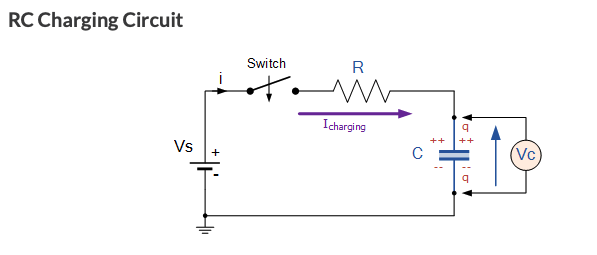
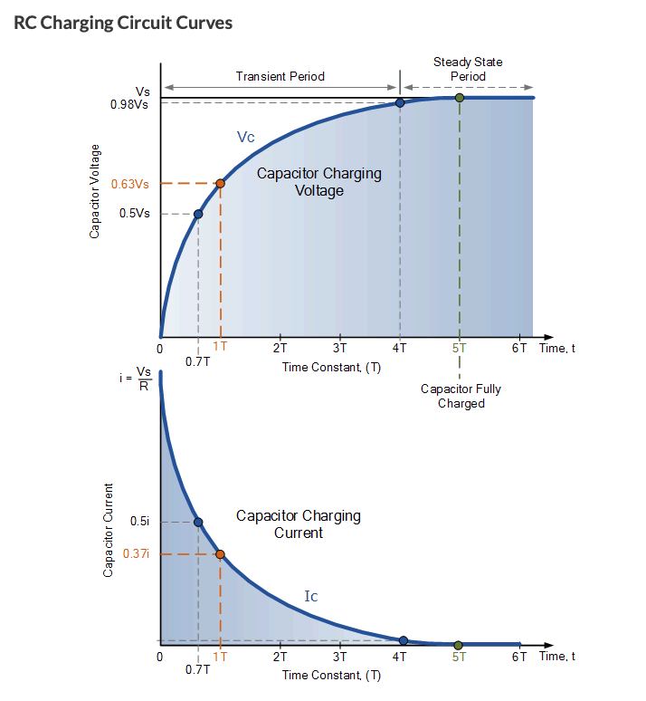
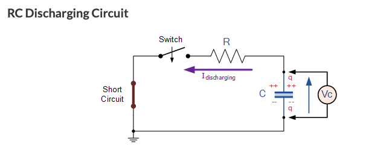

# Library of Acquired Electronics

## RC Circuits

All electrical systems have a time delay when voltage, signal, DC or AC is applied to it. This time delay is called the circuit's time constant (τ) which represents the time response of the circuit when a step voltage or signal is applied.

### Capacitor Rules
When a voltage is applied to a discharged capacitor the capcacitor draws charging current and charges up. When the voltage is reduced the capacitor begins to discharge in the opposite direction. The charging and discharging of a capacitor is never instant but takes some amount of time to occur within a certain percent of its max capacity. The time it takes is the time constant τ.

### RC Charging
If a resistor and capacitor are in series the capacitor will charge through the resistor until the voltage across the capacitor is equal to the supply voltage. The time it takes for the capacitor to fully charge is 5τ. The time it takes for a capacitor to charge 63% of its capacity is equal to τ due to the exponential decay of voltage across the capacitor as it charges.

From AspenCore Inc:\

### Time Constant
The time constant is given by:

<i>τ = RC</i>

Where R is the resistance in Ohms and C is the capacitance in Farads.

### Instantaneous Voltage Across Capacitor
The instantaneous voltage over the capcitor during the charge cycle is given by:

<i>Vc = Vs(1-e(-t/τ))</i>

Where Vc is the voltage across the capcitor, Vs is the supply voltage, t is the instantaneous time since voltage application and τ is the time constant of the circuit.

### Capacitor Charge Voltage and Current
From AspenCore Inc.:\

After 4τ the capacitor is virtually charged and is said to be steady state. Therefore the interval [0, 4τ] is the transient period.

### RC Discharging
If a fully charged capacitor is disconnected from its supply voltage it will hold its charge indefinitely (assuming ideal conditions) until it is discharged. If we take the RC charging circuit and short the battery and close the switch we have an RC discharging circuit.
From AspenCore Inc.:\

Similarily to the charging case the time it takes for the capacitor to fully discharge is 5τ. The time it takes for a capacitor to discharge 63% of its capacity is equal to τ due to the exponential decay of voltage across the capacitor as it discharge.

### Instantaneous Voltage Across Capacitor
The instantaneous voltage over the capcitor during the charge cycle is given by:

<i>Vc = Vs(e(-t/τ))</i>

Where Vc is the voltage across the capcitor, Vs is the supply voltage, t is the instantaneous time since Vc drain and τ is the time constant of the circuit.

### Capacitor Discharge Voltage and Current
From AspenCore Inc.:\

Generate a 100ns pulse using an RC circuit.

